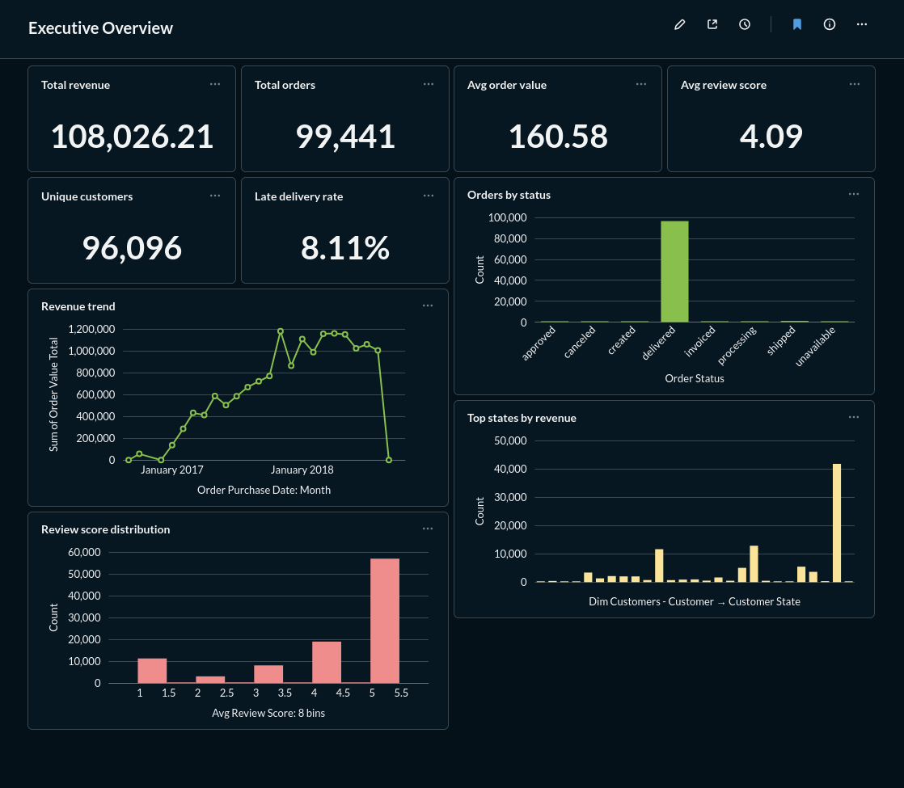
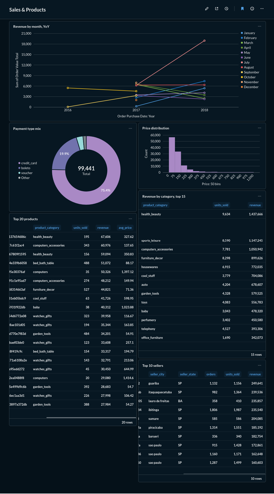
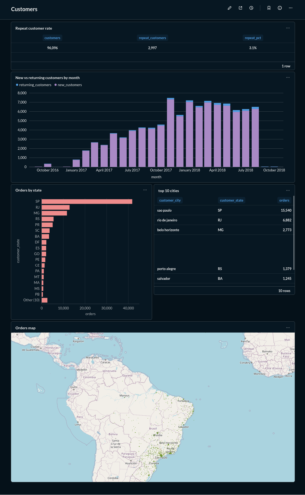
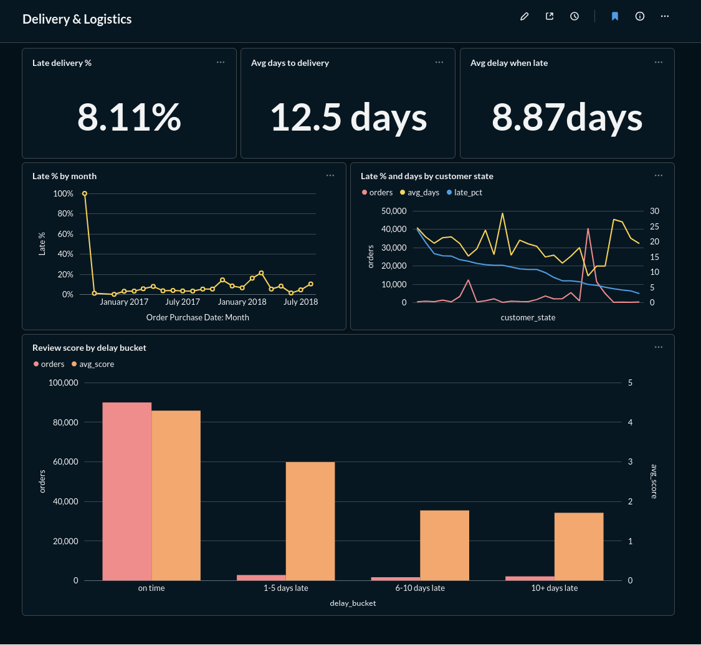

# End-to-End E-Commerce Analytics Pipeline

> [!NOTE]
> **The codebase is human-written; only this README was generated with AI.**

---

A production-style batch ELT (Extract, Load, Transform) data pipeline that ingests raw e-commerce data (Olist Brazilian E-Commerce dataset) into MinIO object storage, loads raw data into PostgreSQL, transforms it through staging, intermediate, and curated star-schema layers using dbt, orchestrates workflows with Apache Airflow 3, and serves interactive analytics dashboards in Metabase.



## Architecture

```
Raw CSV Dataset (data/archive)
         │
         ▼
MinIO Object Storage (bucket: ecommerce-analytics / uploads/raw/)
         │
         ▼ (Airflow DAG: e-commerce-analytics)
PostgreSQL Data Warehouse (raw schema)
         │
         ▼
dbt Transformations (dbt_ecommerce)
   ├── Staging Layer       (schema: staging      │ views)
   ├── Intermediate Layer  (schema: intermediate │ views)
   └── Curated Layer       (schema: curated       │ tables - star schema)
         │
         ▼
Metabase Dashboards & Analytics
```

## Tech Stack

- **Data Orchestration**: Apache Airflow 3.3.1 (LocalExecutor with DockerOperator)
- **Data Transformations**: dbt (`dbt-postgres` v1.11 / v2.0)
- **Object Storage**: MinIO (S3-compatible bucket storage for raw landing data)
- **Database / Data Warehouse**: PostgreSQL 17 (stores `raw`, `staging`, `intermediate`, `curated`, and `metabase_db`)
- **Visualisation**: Metabase (business dashboards & reporting)
- **Containerisation & Management**: Docker, Docker Compose, pgAdmin 4, and Dozzle (container log monitoring)
- **Environment & Dependency Management**: Python 3.14 & [uv](pyproject.toml)
- **Data Exploration**: Jupyter Notebook ([eda.ipynb](eda.ipynb))

## Project Structure

```
.
├── config/                      # Airflow environment configuration (airflow.cfg)
├── dags/                        # Airflow DAG definitions
│   └── ecommerce_elt_pipeline_dag.py
├── data/                        # Raw dataset directory
│   └── archive/                 # Olist Brazilian E-Commerce CSV files
├── dbt_ecommerce/               # dbt transformation project
│   ├── models/
│   │   ├── staging/             # Data cleaning, column renaming & type casting (views)
│   │   ├── intermediate/        # Business joins & metrics aggregations (views)
│   │   └── curated/             # Final star schema dimensional model (tables)
│   ├── Dockerfile               # Custom Docker image for dbt model execution
│   ├── dbt_project.yml          # dbt project configuration
│   └── profiles.yml             # dbt database connection profiles
├── images/                      # Dashboard preview screenshots
├── logs/                        # System & execution logs (Airflow & dbt)
├── plugins/                     # Custom Airflow plugins
├── scripts/                     # Database setup scripts
│   └── initdb.sql               # PostgreSQL initialization (creates metabase_db & raw schema)
├── .env.example                 # Template environment configuration file
├── docker-compose.yml           # Complete container environment orchestrator
├── eda.ipynb                    # Exploratory Data Analysis notebook
├── pyproject.toml               # Python project configuration & uv dependencies
└── uv.lock                      # Dependency lockfile
```

## Data Pipeline Overview

1. **Landing**: Raw CSV files from the Olist dataset in `data/archive/` are ingested into MinIO bucket `ecommerce-analytics` under key prefix `uploads/raw/`.
2. **Raw Ingestion**: Airflow task `upload_to_postgres` extracts the CSV files from MinIO, appends an `_loaded_at` ingestion timestamp, and loads them into the `raw` PostgreSQL schema.
3. **Staging Layer** (`staging` schema): dbt models standardise field names, convert data types, and cleanse raw tables:
   - `stg_customers`, `stg_orders`, `stg_order_items`, `stg_order_payments`, `stg_order_reviews`, `stg_products`, `stg_sellers`, `stg_geolocation`, `stg_product_category_name_translation`.
4. **Intermediate Layer** (`intermediate` schema): dbt models compute modular business logic, deduplicate geolocation data, and aggregate metrics prior to dimensional modelling:
   - `int_geolocation_deduped`, `int_order_items_agg`, `int_order_payments_agg`, `int_order_reviews_agg`, `int_orders_enriched`, `int_orders_joined`, `int_products_enriched`.
5. **Curated Layer** (`curated` schema): Final production dimensional model (star schema) built as materialized tables:
   - **Dimensions**: `dim_customers`, `dim_dates`, `dim_products`, `dim_sellers`
   - **Facts**: `fct_orders`, `fct_order_items`
6. **Orchestration**: The Airflow DAG `e-commerce-analytics` executes tasks sequentially:
   `start` ➔ `upload_to_minio` ➔ `upload_to_postgres` ➔ `run_dbt_models` (via DockerOperator) ➔ `end`.

## Services & Ports Map

When running `docker compose up -d`, the following services will be available:

| Service | Host Port / URL | Credentials / Details |
| :--- | :--- | :--- |
| **Airflow Web UI** | [http://localhost:8090](http://localhost:8090) | Default: `airflow` / `airflow` |
| **Metabase** | [http://localhost:3000](http://localhost:3000) | Initial setup wizard / configured admin |
| **MinIO Console** | [http://localhost:8001](http://localhost:8001) | Configured via `.env` (`MINIO_ROOT_USER`) |
| **MinIO S3 API** | [http://localhost:8000](http://localhost:8000) | S3 Endpoint for Airflow S3Hook |
| **pgAdmin 4** | [http://localhost:8082](http://localhost:8082) | Configured via `.env` (`PGADMIN_DEFAULT_EMAIL`) |
| **Dozzle Log Viewer**| [http://localhost:8080](http://localhost:8080) | Live Docker container log stream |
| **PostgreSQL DB** | `localhost:5432` | DB: `ecommerce` (user/pass via `.env`) |

## Setup & Getting Started

### Prerequisites

- Docker & Docker Compose
- (Optional) [uv](https://github.com/astral-sh/uv) or Python 3.14+ for local development

### Quick Start

1. **Clone the repository and prepare environment variables**:
   ```bash
   cp .env.example .env
   # Edit .env to set your desired passwords and user configurations
   ```

2. **Start all docker services**:
   ```bash
   docker compose up -d
   ```

3. **Trigger the Data Pipeline**:
   - Access Airflow at [http://localhost:8090](http://localhost:8090).
   - Unpause and trigger the `e-commerce-analytics` DAG.
   - The DAG will upload raw CSVs to MinIO, transfer data into PostgreSQL (`raw` schema), and trigger `dbt build` inside the `dbt` container.

4. **Explore Transformed Data**:
   - Open Metabase at [http://localhost:3000](http://localhost:3000) and connect to PostgreSQL (database `ecommerce`, schema `curated`).
   - Monitor real-time container logs with Dozzle at [http://localhost:8080](http://localhost:8080).
   - Inspect PostgreSQL database tables via pgAdmin at [http://localhost:8082](http://localhost:8082).

### Running dbt Commands Manually

To execute dbt models or tests directly:

```bash
# Run dbt build using the container
docker compose exec dbt dbt build

# Or run specific models
docker compose exec dbt dbt run --select curated
```

## Dashboard Screenshots

| Dashboard | Preview |
|---|---|
| Executive Overview |  |
| Sales & Products |  |
| Customers |  |
| Delivery & Logistics |  |

---

*Built with modern data engineering best practices using Airflow 3, dbt, PostgreSQL, MinIO, and Metabase.*
